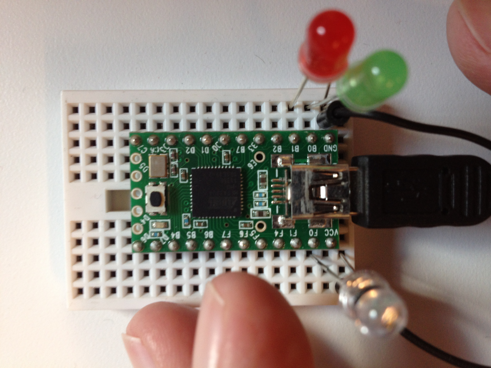

A Brief Introduction
====

# Abstract 

Brief is a scriptable firmware and protocol for interfacing hardware with .NET libraries and for running real time control loops.

# Introduction

Brief is so easy to use that you may be entirely unaware of it. Perhaps the robotics hardware you’ve chosen for your project is using the Brief firmware and is exposed as a USB device under Windows with interfacing libraries already available. In this case you’ve already been working at a much higher level without a care in the world about microcontrollers and hardware interfacing. This is the intended beauty of the system. The introduction here is for those of you who, out of curiosity or need, want to dive in and learn the inner workings. We think you’ll find it very interesting and uniquely simple and powerful.

It is comprised of the following:

* VM – a tiny stack machine running on the MCU.
* Protocol – an extensible and composable set of commands and events.
* Language – a Forth-like interactive scripting language compiled for the VM.
* Interactive – console for interactive experimentation and development.
* Interface – from managed code.

You will find that there is absolutely nothing off-limits in the Brief system. It purposely leaves the “wires exposed” so to speak. It is meant to be tinkered with at all levels. The interactive REPL is a wonderful way to experiment with new hardware. You can go much further (still without cracking open the firmware) by customizing the protocol with your own commands and events. You can customize the heartbeat payload. You can write your own driver libraries for new hardware. You can script the firmware with your own real time control logic. Finally, the firmware itself is open source and you’re free to extend it. You can easily do so in ways that continue to work seamlessly within the existing scriptable protocol, commands and event system.

Brief is not a tool chain for programming standalone MCUs that are not connected to a PC. It is potentially possible to load byte code from flash or EEPROM rather than pushing down from a PC but this is not the intent.

## Demo

Brief targets AVR and ARM MCUs with at least 16Kb of flash and 1Kb of SRAM. Here we’ll use the Teensy with an ATmega32U4; a nice chip with 32Kb flash, 2.5Kb SRAM and built-in USB.

### Setup

If you’re lucky, your MCU is already running the Brief firmware. Simply connect it to the PC and note the COM port on which it’s communicating. Otherwise, you will need to flash it.

#### Flashing Firmware

We’re using the loader provided by PJRC:

	teensy_loader_cli -mmcu=atmega32u4 -w brief.hex

You may also open the Brief.ino in the Arduino IDE (with TeensyDuino if you’re using that board) and Upload from there.

#### Setup

If you plan to modify the firmware (see Custom Instructions below) then you will need to setup your environment:

1. Install Arduino IDE
2. Install TeensyDuino
3. Install Brief and Reflecta libraries (copy to \libraries\)

### Interactive Console

Once the firmware has been flashed, launch Brief.exe. This is an interactive console giving you full control of the MCU. It can be used to experiment with and to even program it.

Type the following (replacing 'com16 appropriately):

	'com16 connect

You may see in the photo above that we have a pair of LEDs on pins 0 and 1, as well as an IR sensor on pin 21 (see pinouts for the Teensy 2.0). To initialize a pin:

	output 0 pinMode

To light up the green LED:

	high 0 digitalWrite

The LED lights up! You can probably guess what the following does:

	low 0 digitalWrite

If you’ve used the Arduino IDE then you recognize that what we’re doing is equivalent to pinMode(0, OUTPUT), digitalWrite(0, HIGH), etc.

Reading sensors is equally easy:

	input 21 pinMode
	21 analogRead

This sets up the pin and reads the IR sensor, but where does the value go? It goes onto a stack on the MCU where it can be used by other commands. We can send values back to the host PC with something like:

	123 event

This emits the sensor value (which happens to be 49) as a PC-side event with an event ID of our choosing (123). The event command isn’t just for emitting sensor values. It will emit any value on top of the stack regardless of how it got there. This will make more sense momentarily. You see the following at the console. From the Robotics for Windows libraries this is surfaced as a regular .NET event.

	Event (id=123): 49

If you hold your hand over the sensor and again issue:

	21 analogRead 123 event

You see a lower value:

	Event (id=123): 32

Isn’t this nice? No edit/compile/flash development cycle. We can play with the sensor and interactively see the range of values we get under various conditions. Having an interactive console like this completely changes the way you work.

Rather than sending values back to the host PC, you may also use them directly on the MCU. For example, a “nightlight” application which turns on the LED only when the room is dark:

	21 analogRead 40 < [high 0 digitalWrite] [low 0 digitalWrite] choice

We are starting to get into some complicated looking syntax (we’ll improve it below), but I’m sure you get the gist. Sequences of words within s	quare brackets are quotations and can be thought of as anonymous lambdas pushed onto the stack. The choice word is a combinatory that takes two quotations and executes one or the other of them depending on whether pin 21 was less than 40. We’re sampling pin 21 and, depending on whether it reads below 40, setting pin 0 high/low to turn on/off the LED.  This sequence can be added to the main loop and run completely independently of the PC.
 
# Overview

Before diving into a very detailed bottom-up discussion (see Underview below), let’s look at a top-down overview. Here we will purposely introduce concepts without full explanation so as to cover a lot of ground quickly. This will give you a good feel for the system as a whole and will show you where we’re headed as we methodically build up from primitives later.

As we’ve seen, Brief is stack VM used to facilitate a programmable protocol between the PC and MCU. The Robotics for Windows libraries use this to dynamically customize the protocol according to the attached hardware. It may also be used to run control loop logic on the MCU rather than incur the latency of sensor values up to the PC, feeding logic there which in turn pushes down actuator commands back down to the MCU.

As seen in the demo, Brief is also a Forth-like language. Unless you’ve programmed in Forth before, I’m sure the syntax looks completely foreign and somehow inverted. The truly surprising thing is that there is actually virtually no syntax at all. This is practically a direct representation of the semantics of the Brief VM. This language is used by library authors as an embedded DSL. The interactive console can also be invaluable to application writers when experimenting with new hardware.

## Stack Machines in General

There are some very beautiful stack machines in hardware. Since the mid-80s though, register machines have clearly dominated and stack machines have receded into virtual machines such as the JVM and the CLR.

In register machine instruction sets each operator comes packed with operands. An add instruction, for example, needs to know which registers and/or memory locations to sum. In a stack machine virtually all instructions take exactly zero operands. This makes the code extremely compact and also leads to abundant opportunities to factor out redundant sequences.

The Brief addition instruction + compiles to just one byte. A sequence like 42 7 + produces 49 on the stack. The literals are indirectly left on the stack to be consumed. They are not operands tied to that instruction. They could have just as easily have been left there as the result of reading pins or by some previous arithmetic.

In fact you can use Brief as an RPN calculator and this may be a good way to get used to the stack and to this reversed word ordering. If you’ve used an HP calculator you may already be familiar with RPN. Try this:

	42 7 + 6 *

It is equivalent to the infix expression (42 + 7) * 6. If what you really wanted was 42 + (7 * 6) then:

	42 7 6 * +  or  7 6 * 42 +

A benefit of RPN is the fact that you don’t have operator precedence or any need for parenthesis.

There are commands for manipulating the stack to prepare arguments (dropping, duplicating, swapping, …), but they are used sparingly.

## Execution Model

The incantations we entered are being broken into whitespace separated words. Words may be signed integer literals such as 0, -7, 21, 123, 40, ... They may represent constants such as input, output, high, low, … They may be Brief commands such as pinMode, digitalWrite, analogRead, event. Very rarely do they indicate syntactic structure.

Words are executed from left to right. Some are nouns. Literals and constants are pushed onto the stack. So for example, 0 output causes two values to be placed on the stack (output = 1). Some are verbs and cause action to be taken by the MCU. The word pinMode consumes these two values and sets the mode. Some commands both consume and produce values on the stack. For example the phrase, 21 analogRead 123 event will push a 21 and then analogRead will consume this as a parameter as well as push the pin’s analog value, then a 123 will be pushed. The tricky part is that this event ID and the analog pin value from earlier will be taken to signal an event back to the PC.

This is how it goes; each word taking and/or leaving values on the stack. The concatenation of these words makes a useful expression.

## Defining New Words

You may extend the built-in words with your own; defining new ones in terms of existing primitives or secondary words you’ve previously defined:

	'0 'green def

This makes a word for the pin number to which our green LED is attached. The form for defining a word is […] 'foo def as in:

	[1] 'red def

Or, since the definition is a single word, it may be quoted with a tick ('1 'red def). Now we don’t have to hardcode these values and the purpose of our code is clearer.

	output green pinMode
	output red pinMode

Definitions can be multi-word phrases. In fact, whenever you see a sequence of words used repeatedly it is a good candidate to be factored out. It may be going a little overboard but let’s factor out the phrase output pinMode.

	[output swap pinMode] 'outmode def

It may seem strange to take a sequence expecting parameters and separate it into a new definition with the parameters missing. Our new outmode word expects a pin number on the stack and sets the mode. This is the elegance of the stack machine and of our syntax matching those semantics.

If you have experience in functional programming you may already be comfortable with a point-free/tacit style and may think of words as being functions taking a stack and returning a stack. Then you can think of juxtaposition of words as composition of functions. The whitespace between words is the composition operator. Forth is all about composition.

Back to our refactoring, the following is a little more succinct now:

	green outmode
	red outmode

Let’s see what we can do about the “nightlight” example:

	21 analogRead 40 < [0 high digitalWrite] [0 low digitalWrite] choice

Let’s give a few of the phrases names:

	'21 'sensor def
	[analogRead 40 <] 'dark? def

Now the same program can be written more clearly:

	sensor dark? 'high 'low choice green digitalWrite

Getting even more tricky we may notice that the value for high and low is the same as the truth values (true/false) pushed by the < word. In this case, the phrase [on] [off] choice is almost completely redundant. We can just write the truth value directly:

	sensor dark? green digitalWrite

## Defining a Vocabulary

The style of programming in Forth is to treat it as a programmable programming language. Words layered on words, layered on words; raising the vocabulary up to your problem domain so that you can talk about it in its own terms. This is more of a language oriented approach in which the whole language bends toward your application domain rather than the traditional object oriented approach in which only the type system bends. This idea becomes clear later when we get into authoring defining words; words that define words – much like Lisp-style macros.

To get just an ever so tiny glimpse, let’s define a language for controlling a pair of motors. Without getting into the details, the following works with the Sparkfun MonsterMoto controller board:

	[5 7 8] 'left def
	[6 4 9] 'right def

	[swap digitalWrite] 'pin def
	[swap analogWrite] 'power def

	[low  pin high pin power] 'cw def
	[high pin low  pin power] 'ccw def
	[high pin high pin 0 swap analogWrite] 'stop def

The left/right words push pin numbers which, along with a power value expected on the stack, is used to cause clockwise (cw) or counter-clockwise (ccw) driving.

We can further define:

	[dup left cw  right cw]  'forward  def
	[dup left ccw right ccw] 'backward def

Now we can say phrases like:

	255 left cw
	100 right ccw

	50 forward
	10 backward

	left stop
	right stop

The words work together to form essentially a little language for controlling the motors.

## Extending the Protocol

Not only can definitions be thought of as extending the language, but they can be thought of as extending the protocol between the PC and MCU.

These don’t just save typing. They save bytes over the wire. These definitions are being compiled and persisted in a dictionary on the MCU. They’re sent down once and then invoking them becomes a single instruction over the wire thereafter.

## Extending the Control Loop

If we define our nightlight sequence as a new word:

	[sensor dark? green digitalWrite] 'nightlight def

We can add it to the main control loop with setLoop:

	'nightlight setLoop

Now the PC is completely out of the loop (literally). The LED responds immediately as you can move your hand over the sensor and back away from the sensor. Stop the loop whenever you like with stopLoop.

Have fun with it!

	[200 delay] 'pause def
	[red on green on pause red off green on pause] 'blink def
	'blink setLoop
 
Notice that we’re using a delay word to do a blocking pause. This isn’t a Brief primitive. It is a custom instruction added below in the Custom Instructions section.

## Triggered Events

We can use this same mechanism to set up conditional events. Instead of the PC polling sensor values and reacting under certain conditions we can describe the conditions in Brief and have the MCU do the filtering and signal the PC.

	[sensor dark? [123 456 event] if] 'signalWhenDark def
	'signalWhenDark setLoop

In this way the sensor polling can happen at a hundreds of KHz frequency until it needs to report to the PC over USB.

## Custom Heartbeat

We can use a loop word to provide an unsolicited stream of sensor data.

	[sensor analogRead 123 event] 'streamLightData def

This may completely overwhelm the PC however. Instead you may want to throttle it to every 100th loop iteration or something similar:

	[loopTicks 100 mod 0 = [streamLightData] if] 'throttledData def

We’ll get deeper into the words being used here, but if you want to pack multiple values into a single event (which comes in as an ID-tagged byte array at the PC) then you can do something like the following:

	[123 6 event{ 19 analogRead data
				20 analogRead data
				21 analogRead data }event] 'packedData def

By the way, the multi-line formatting is just for readability. Any whitespace between words will do.

A packed heartbeat can reasonably be expected to achieve frequencies approaching 1KHz if needed.

## Attaching Interrupts

You can attach Brief words as interrupt routines with attachInterrupt which, like setLoop, expects the address of a word to attach.

For example, to turn on the LED when interrupt zero signals a change you can simply say:

	[red on] 'ontrigger def
	'ontrigger 0 change attachInterrupt

To detach just say `0 detachInterrupt`.

Other triggers include low, rising or falling pin values, timers, etc.

# Underview

So far we have been exploring Brief in a sparse top-down fashion. Now that you have the gist of the system and where we’re headed, here is a thorough bottom-up discovery of Brief.

## Brief VM

The Brief VM is a stack machine executing single-byte instructions. There are some very beautiful stack machines in hardware, but since the mid-80s register machines have clearly dominated and stack machines have receded into virtual machines such as the JVM and the CLR.

### Two Stacks and a Dictionary

The Brief VM revolves around a pair of stacks and a block of memory serving as a dictionary of subroutines.

The dictionary is typically 1Kb. This is where Brief byte code is stored and executed. While it can technically be used as general purpose memory, the intent is to treat it as a structured space for definitions; subroutines, variables, and the like, all contiguously packed.

The two stacks are each eight elements of 16-bit signed integers. They are used to store data and addresses. They are connected in that elements can be popped from the top of one and pushed to the top of the other. They are circular with no concept of overflow or underflow. When too many elements are pushed then the oldest are overwritten. When too many elements are popped they begin to repeat. Often elements can be abandoned on the stack rather than waste cycles removing them.

One stack is used as a data stack; persisting values across instructions and subroutine calls. With very few exceptions, instructions get their operands only from the data stack. All parameter passing between subroutines is done via this stack.

The other stack is used by the VM as a return stack. The program counter is pushed here before jumping into a subroutine and is popped to return. Be careful not to nest subroutines more than eight levels deep! It should be noted that infinite tail recursion is possible none the less.

The return stack is commonly also used to store data that is local to a subroutine. It is safe to push data here to be recovered after a subroutine call. It is not safe to use it for passing data between subroutines. That is what the data stack is for. Think of arguments vs. locals.

### Zero Operand Instructions

In a register machine each operator comes packed with operands. An add instruction, for example, needs to know which registers and/or memory locations to sum. In a stack machine virtually all instructions take exactly zero operands. This makes the code extremely compact and more composable. Composability is the key.

Brief instructions are single bytes with the high bit reset:

|---|---|---|---|---|---|---|---|
| 0 | x | x | x | x | x | x | x |

The lower seven bits become essentially an index into a function table. Each may consume and/or produce values on the data stack as well as having other side effects. Only three instructions manipulate the return stack. Two are push and pop which move values between the data and return stack. The third is (return) which consumes an address at which execution continues.

### Very Efficient Subroutines

You will see that it is extremely common to factor out redundant sequences of code into subroutines. There is no “call” instruction. Instead, if the high bit is set then the following byte is taken and together (in little endian), with the high bit reset, they become an address to be called.

|---|---|---|---|---|---|---|---|---|---|---|---|---|---|---|---|
| 1 | x | x | x | x | x | x | x | x | x | x | x | x | x | x | x |

This allows 15-bit addressing to definitions in the dictionary.

Upon calling, the VM pushes the current program counter to the return stack. There is a return instruction, used to terminate definitions, which pops the return stack to continue execution after the call.

## Brief Protocol

Brief uses a common framing protocol for communication in both directions between the MCU and the PC. The payload to the MCU contains code to be executed or to be added to the dictionary. The payload to the PC contains events from the MCU.

### Framing

TODO: explain non-Reflecta protocol

### Code

The payload from the PC to the MCU is in the form of Brief code. A trailing byte indicates whether the code is to be executed immediately (0x00) or appended to the dictionary as a new definition (0x01).

A dictionary pointer is maintained at the MCU. This pointer always references the first available free byte of dictionary space (beginning at address 0x0000). Each definition sent to the MCU is appended to the end of the dictionary and advances the pointer.

It is very likely that definitions end with a (return) instruction as the intent is to use the address at which the definition starts as the target of subsequent subroutine calls.

Code sent for immediate execution is not persisted in the dictionary and instead is executed immediately. It is not necessary (though harmless) to end code send for immediate execution with a (return).

### Primitive Instructions

#### Literals

Literal values are pushed to the data stack with lit8/lit16 instructions. These are followed by a 1- or 2-byte operand value as a parameter to the instruction. Literals (as well as branches below) are one of the few instructions to actually have operands. This is done by consuming the bytes at the current program counter and advancing the counter to skip them for execution.

#### Branches

Relative branching is accomplished by branch/zbranch instructions. Conditional and unconditional branching is done by relative offsets as a parameter to the instruction (following byte). These (like literals) are among the few instructions with operands; in this case to save code size by not requiring a preceeding literal.

Notice that there is only the single conditional branch instruction.  There are no 'branch if greater', 'branch if equal', etc. Instead the separate comparison instructions above are used as the preceding predicate.

#### Quotations, Choice and If

Quotations, choice and if need some explanation: The idea behind quotations is something like an anonymous lambda and is used with some nice syntax in the Brief language. The (quote) instruction precedes a sequence that is to be treated as an embedded definition essentially. It takes a length as an operand, pushes the address of the sequence of code following and then jumps over that code. The bytecode is expected to be terminated by a (return) and so the address on the stack is safe to be called. Quotations like these are used in combination with choice, if, setLoop, etc.

The net result is that the sequence is not executed, but its address is left on the stack for future words to call as they see fit.

One primitive that makes use of this is choice which is the idiomatic Brief conditional. It pops two addresses (likely from two quotations) along with a predicate value (likely the result of some comparison or logical operations). It then executes one or the other quotation depending on the predicate.

Another primitive making use of quotations is if which pops a predicate and a single address; calling the address if non-zero.

Many secondary words in Brief also use quotation such as bi, tri, map, fold, etc. which act as higher-order functions applying.

#### Events

Events may be considered simple signed scalar values generated by the event instruction. In this case the data bytes consist of 0-, 1- or 2-bytes depending on the value taken from the stack (see Events section below).

Events may instead be hand packed records of data, such as a heartbeat of sensor data. This is produced using the event{ and }event instructions along with data and cdata instructions between.

#### Memory Fetch/Store

Memory fetches take an address from the stack and push back the contents of that address (within the dictionary). Stores take a value and an address from the stack and store the value to the address. They come in single- and two-byte (little endian) variations.

#### ALU Operations

Binary and unary ALU operations pop one or two values and push back one. These include basic arithmetic, bitwise operations, comparison, etc.

One interesting thing to note is that the truth values used in Brief are zero (0) for false as you’d expect but negative one (-1) for true. This is all bits on which unifies bitwise and logical operations. That is, there is a single set of and/or/xor/not instructions and they can be considered bitwise or logical as you wish.

#### Return Stack Operations

Aside from the usual data stack manipulation instructions (drop, dup, swap, pick, roll), there are several more for moving items between data and return stack. The instructions pop, push, peek each refer to the return stack (popping from return to data, pushing from data to return, …). The return stack is commonly also used to store data that is local to a subroutine. It is safe to push data here to be recovered after a subroutine call. It is not safe to use it for passing data between subroutines. That is what the data stack is for. Think of arguments vs. locals.

#### Dictionary Manipulation

The forget word is a Forthism for reverting to the address of a previously defined word; essentially forgetting it and any (potentially dependent words) defined thereafter.

The (alloc), (free), (tail), and (local)/(local@)/(local!) instructions are all to support IL translation. The CLR doesn't use the evaluation stack for parameter passing and local storage. For example, there are no stack manipulation instructions in IL except drop. Instead, IL code generally makes use of a per-method locals and arguments fetched and stored via instructions such as stloc/ldloc/starg/ldarg.

This is not a feature used in idiomatic Brief code but is here to make IL translation more straight forward. Each method allocated enough space for locals and args. Before returning (or earlier for TCO), this is freed.

The normal way of handling locals in Brief that need to survive a call and return from another word is to store them on the return stack. The (alloc) instruction does this to persist the size of allocation to be used by (free)/(tail) later. Tail call optimization (that is, .tail in the IL) is handled by the (tail) instruction. This frees and pushes back a zero so that freeing later upon return has no further effect.

Local and arg space is allocated from the bottom of dictionary space. The (local) instruction is used for args as well despite the name. It simply pushes the address of the nth slot. This address can then be used by the regular fetch and store instructions. Because 16-bit values are commonly used in translated IL, there are single-byte instructions for this.

#### Arduino Integration

Starting with basic setup and reading/write to GPIO pins. Note we treat high/low values as Brief-style booleans (-1 or 0) to play well with the logical and conditional operations.

I2C support comes from several instructions, essentially mapping composable, zero-operand instructions to functions in the Arduino library: http://arduino.cc/en/Reference/Wire. Brief words (addresses/quotations) may be hooked to respond to Wire events.

Brief word addresses (or quotations) may be set to run upon interrupts.  For more info on the argument values and behavior, see: http://arduino.cc/en/Reference/AttachInterrupt. We keep a mapping of up to six words.

Servo support also comes by simple mapping of composable, zero-operand instructions to Arduino library calls: http://arduino.cc/en/Reference/Servo. We keep up to 48 servo instances attached.

#### Instruction Set

Here is a complete list of primitive instructions.

Note that the naming convention of surrounding in parenthesis means that the instruction is meant to be compiler-generated rather than used in source.

The signature follows the Forth-style stack effect format of input - output. Square brackets mean the value comes as an operand rather than from the stack. Three instructions have effects on the return stack which are not shown in the signature – these are: (return), push and pop.

| Bytecode | Name | Signature | Description |
| 0x00 | (return) | [address] - | Return from subroutine. |
| 0x01 | (lit8) | [value] - | Push following byte as literal. |
| 0x02 | (lit16) | [value] - | Push following two bytes as little endian literal. |
| 0x03 | (branch) | [offset] - | Branch unconditionally by signed byte offset. |
| 0x04 | (zbranch) | [offset] pred - | Branch if zero by signed byte offset. |
| 0x05 | (quote) | [length] - | Push quotation address and jump over length. |
| 0x06 | event{ |id - | Begin packing custom event payload. |
| 0x07 | cdata | value - | Pack event payload 8-bit value. |
| 0x08 | data | value - | Pack event payload 16-bit value (little endian). |
| 0x09 |}event | - | Send event payload. |
| 0x0A | event | id value - | Send single-value event payload. |
| 0x0B | c@ | address - value | Fetch byte. |
| 0x0C | c! | value address - | Store byte. |
| 0x0D | @ | address - value | Fetch 16-bit value (little endian). |
| 0x0E | ! | value address - | Store 16-bit value (little endian). |
| 0x0F | + | y x - sum | Addition. |
| 0x10 | - | y x - difference | Subtraction. |
| 0x11 | * | y x - product | Multiplication. |
| 0x12 | / | y x - quotient | Division. |
| 0x13 | mod | y x - remainder | Modulus. |
| 0x14 | and | y x - result | Bitwise/logical and. |
| 0x15 | or | y x - result | Bitwise/logical or. |
| 0x16 | xor | y x - result | Bitwise/logical xor. |
| 0x17 | lsh | y x - result | Shift y left by x. |
| 0x18 | rsh | y x - result | Shift y right by x. |
| 0x19 | = | y x - result | Predicate y equals x. |
| 0x1A | <> | y x - result | Predicate y not equal to x. |
| 0x1B | > | y x - result | Predicate y greater than x. |
| 0x1C | >= | y x - result | Predicate y greater than or equal to x. |
| 0x1D | < | y x - result | Predicate y less than x. |
| 0x1E | <= | y x - result | Predicate y less than or equal to x. |
| 0x1F | not | x - result | Bitwise/logical not. |
| 0x20 | neg | x - result | Negation. |
| 0x21 | ++ | x - result | Increment. |
| 0x22 | -- | x – result | Decrement. |
| 0x23 | drop | x - | Drop top stack element. |
| 0x24 | dup | x – x x | Duplicate top stack element. |
| 0x25 | swap | y x - x y | Swap top two stack elements. |
| 0x26 | pick | x - result | Duplicate xth stack element to top. |
| 0x27 | roll | x - | Roll stack elements by x. |
| 0x28 | clear | - | Clear stack. |
| 0x29 | push | x - | Push top stack element to return stack. |
| 0x2A | pop | - x | Pop top of return stack onto data stack. |
| 0x2B | peek | - x | Duplicate top of return stack onto data stack. |
| 0x2C | forget | address - | Revert dictionary to address. |
| 0x2D | (alloc) | x - | Allocate x bytes, push x to return stack. |
| 0x2E | (free) | - | Free n bytes (n taken from return stack). |
| 0x2F | (tail) | - | Free n bytes (n taken from return stack and replaced with 0) |
| 0x30 | (local) | index - address | Get address of local (to be used with regular fetch/store). |
| 0x31 | (local@) | index - value | Fetch value of local (by index rather than address). |
| 0x32 | (local!) | value index - | Store value to local (by index rather than address). |
| 0x33 | (call) | address - | Call address (used internally by compiler). |
| 0x34 | choice | pred p q - | Call one or the other quotation depending on predicate. |
| 0x35 | if | pred q - | Call quotation depending on predicate. |
| 0x36 | loopTicks | - x | Get number of loop iterations since reset. |
| 0x37 | setLoop | q - | Set loop word. |
| 0x38 | stopLoop | - | Reset loop word. |
| 0x39 | (reset) | - | Reset MCU (clearing dictionary, stacks, etc.) |
| 0x3A | pinMode | mode pin - | Set pin mode. |
| 0x3B | digitalRead | pin - value | Read digital pin. |
| 0x3C | digitalWrite | value pin - | Write to digital pin. |
| 0x3D | analogRead | pin - value | Read analog pin. |
| 0x3E | analogWrite | value pin - | Write to analog pin. |
| 0x3F | wireBegin | - | Join I2C bus as master. |
| 0x40 | wireRequestFrom | address count - | Request bytes from device at address. |
| 0x41 | wireAvailable | - count | Get number of bytes available. |
| 0x42 | wireRead | - value | Read byte from I2C device. |
| 0x43 | wireBeginTransmission | reg - | Begin transmission to register. |
| 0x44 | wireWrite | value - | Write byte to I2C device. |
| 0x45 | wireEndTransmission | - | End transmission. |
| 0x46 | wireSetOnReceive | q - | Set callback word. |
| 0x47 | wireSetOnRequest | q - | Set callback word. |
| 0x48 | attachISR | q interrupt mode - | Attach interrupt word. |
| 0x49 | detachISR | interrupt - | Detach interrupt word. |
| 0x4A | servoAttach | pin - | Attach servo on given pin. |
| 0x4B | servoDetach | pin - | Detach servo on given pin. |
| 0x4C | servoWriteMicros | value pin - | Write microseconds value to servo on given pin. |
| 0x4D | milliseconds | - value | Get number of milliseconds since reset. |
| 0x4E | pulseIn | mode pin - | Read a pulse on given pin. |

### Custom Instructions

It’s likely that you can accomplish what you want without customizing the firmware; instead building from the primitives already available. However, if necessary you are free to do so.

However, for example we can introducing a time delay instruction and to keep things simple we can just use the blocking delay() function provided by the Arduino libraries (this is normally a bad idea to block in the main loop rather than a state machine and this is why delay isn’t a Brief primitive).

To introduce a new instruction in the VM we need only define a void (*fn)() function and bind it. Notice that instruction functions take and return no values. As we’ll soon see, Brief instructions take all of their arguments from the stack (brief::pop()) and leave their return values there as well (brief::push(...)). This is how instructions compose and conforming to this for our custom instruction will allow for composition with existing primitives.

	void delayMillis()
	{
		delay((int)brief::pop());
	}

Many of the primitives are really just thin wrappers such as this over Arduino library functionality.

To bind this as a new instruction (say, bytecode 100) we add the following at the end of setup:

	brief::bind(100, delayMillis);

That’s it. Very simple.

Again though, as simple as this is, you are encouraged to build from existing primitives as much as possible. If you must add custom instructions then you are encouraged to add very low-level basic ones that may be composed into compound expressions.

In the Custom Instructions section below we add an instruction to do a blocking delay. This isn’t part of the built-in primitives. There we give it bytecode 100. To use this raw instruction we will want to give it a friendly name in the interactive:

	'nightlight setLoop

### Secondary Definitions

## Events

The MCU may send unsolicited data up to the PC in the form of an event. Requests may cause events, but it is not a request/response model. That is, the event is always async and is not correlated with a particular request (at the protocol level).

Events follow the same framing protocol from above. The payload is a single-byte identifier followed by an arbitrary number of data bytes.

| ID | 1 byte | Data | n bytes |

### Scalar Events

Events may be considered simple signed scalar values generated by the event instruction. In this case the data bytes consist of 0-, 1-, 2-bytes depending on the value taken from the stack. The value 0 is transmitted as zero-length data and may be used when the ID alone is enough information to signal an event. Other values have various lengths:

| x = 0 | 0 bytes |
| -128 ≥ x ≤ 127 | 1 byte |
| othrewise | 2 bytes |

For example `42 123 event` will emit a single byte value 123 as event ID 42.

### Vector Events

Events may instead be hand packed records of data, such as a heartbeat of sensor data. This is produced using the event{ and }event instructions (notice that the parenthesis are part of the word tokens). For example 42 event{ will transmit the sequence number for the framing protocol along with an event ID of 42. Event data may be included using data and cdata. For example 123 cdata 456 data transmits the single-byte value 123 followed by the two-byte value 456. Finally }event emits the checksum and the end byte for the framing protocol. The PC will need to know to expect a 3-byte data payload packed this way for event ID 42.

An example heartbeat loop, reporting on a pair of analog pins, could be defined by:

	[42 event{ 20 analogRead data 21 analogRead data }event] setLoop

This is to show the underlying Brief instructions for implementing events. Normally you only need to specify the packing and leave allocation of event IDs and wiring events to callbacks on the PC side to be handled for you by an instance of IMicrocontrollerHal.

### Reserved Event IDs

Several event IDs are used by the MCU to notify the PC of protocol and VM activity. Normally you deal with these at the level of APIs on an instance of IMicrocontrollerHal, but this is build atop the same event system:

| ID | Value | Meaning |
| 0xFF – Reset | None | MCU reset |
| 0xFD - VM | 0 | Return stack underflow |
|           | 1 | Return stack overflow |
|           | 2 | Data stack underflow |
|           | 3 | Data stack overflow |
|           | 4 | Indexed out of memory |

## Brief Compiler

TODO

## Communications

The MCU communicates with the PC over USB using the protocol and payload formats already described.

## Brief Console

TODO

## Brief Interface

TODO
