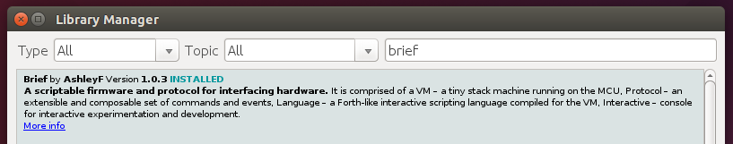

Brief Embedded
==============

Brief Embedded is a scriptable firmware and protocol for interfacing hardware with .NET.

It may be discovered and installed via the Arduino Library Manager. Just search for "brief" and click Install.

Have fun!

----

[Full documentation here](Documents/README.md). The code itself contains literate style documentation as well.

This is a fork [from here](http://github.com/ashleyf/brief/tree/gh-pages/embedded), but simplified by removing Reflecta, IL translation and several instructions. This is the most active fork now-a-days.
